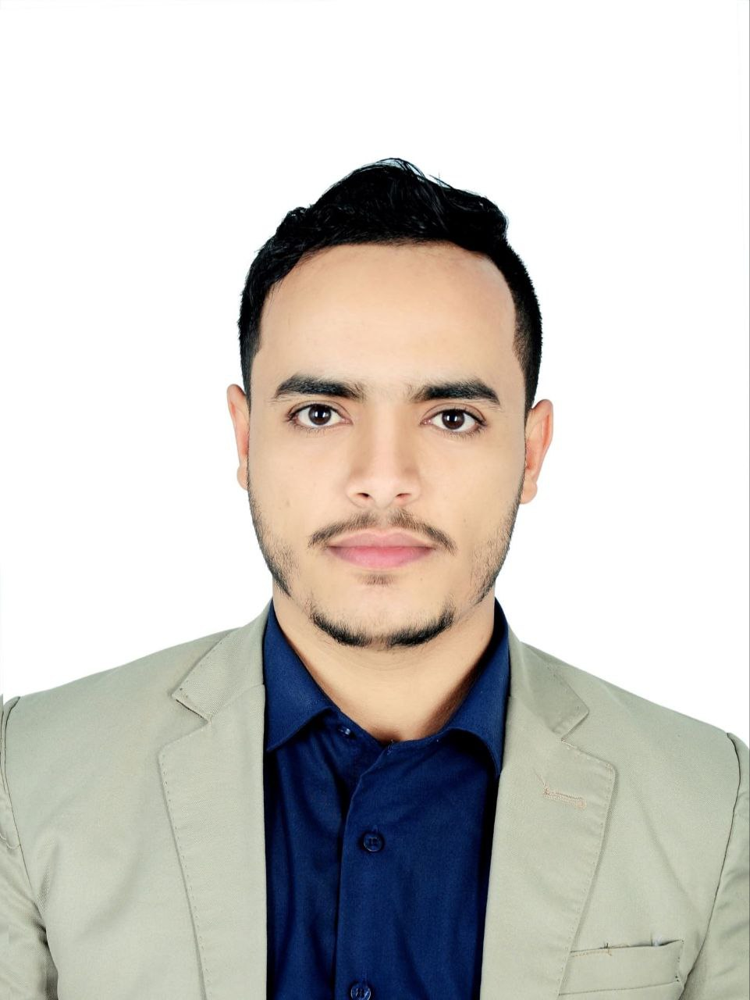
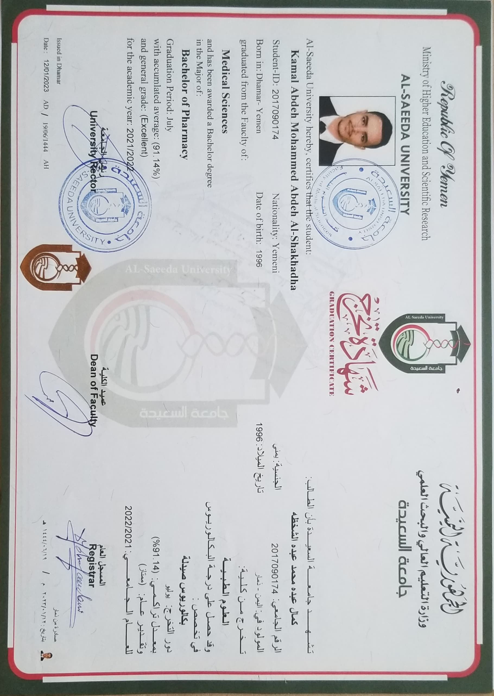

<header>
  <h1> د/ كمال الشخظه </h1>
  
  
حاصل على شهادة البكالوريوس في الصيدلة

</header>

<section>
  <h2>المؤهلات العلمية</h2>
  <ul>
    <li>
      <a href="secondary-certificate.jpg" target="_blank">شهادة الثانوية العامة</a>
      
    </li>
    <li>
      <a href="university-certificate.jpg" target="_blank">شهادة جامعية في الصيدلة</a>
      
    </li>
  </ul>
</section>

<section>
  <h2>المجال المهني</h2>
  
صيدلاني متخصص في تقديم الاستشارات الدوائية ومتابعة الحالات الصحية للمرضى. لديه خبرة عملية في الصيدليات المجتمعية، ويعمل على توفير حلول دوائية فعالة وآمنة.

</section>

<section>
  <h2>معلومات التواصل</h2>
  
البريد الإلكتروني: <a href="mailto:kamalalshakhzah96@gmail.com">kamalalshakhzah96@gmail.com</a>

  
رقم الهاتف: <a href="tel:+967777768921">+967 777768921</a>

</section>

</body>
</html>
